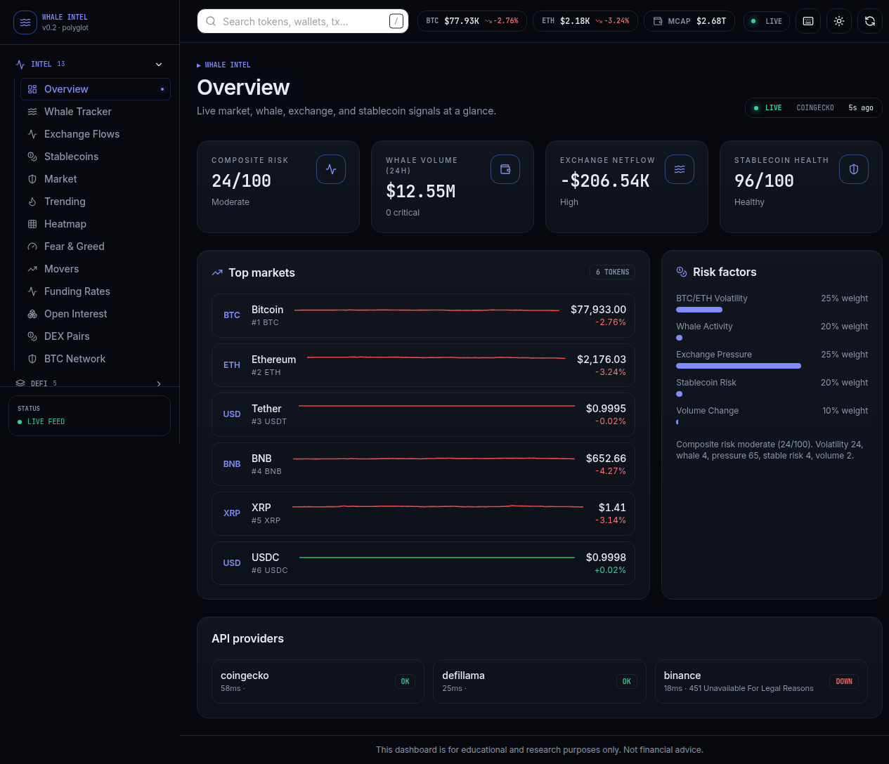
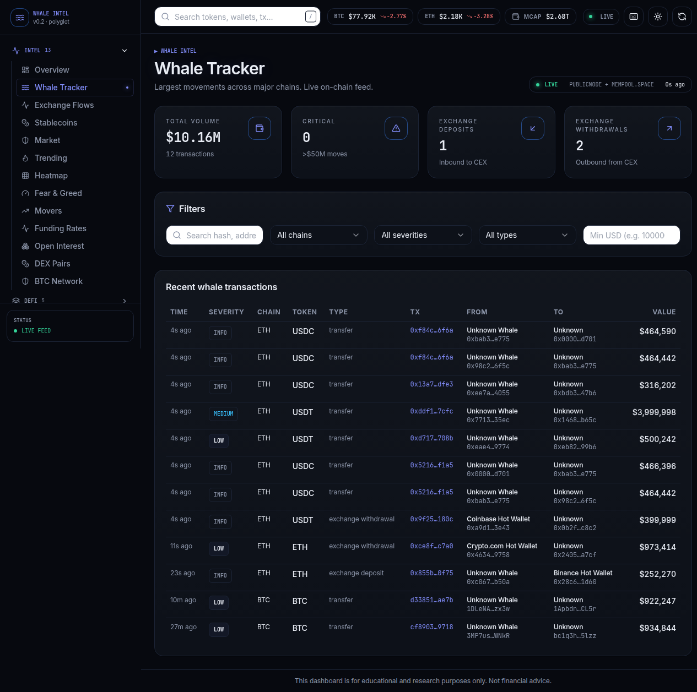
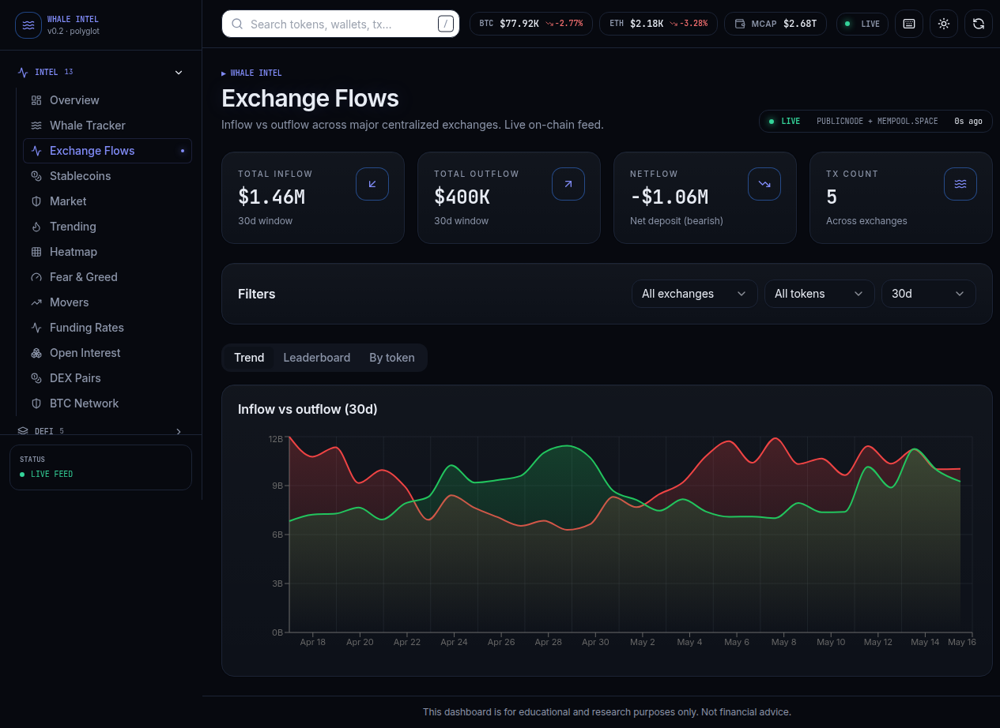
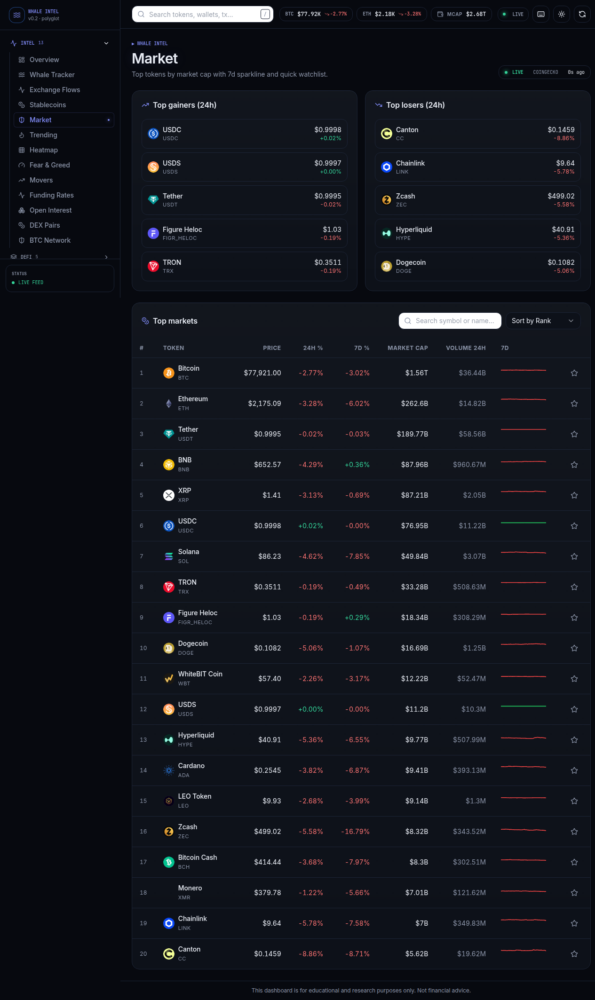

# Whale Intel · Multi-Chain On-Chain Intelligence Terminal

> Real-time whale movement tracking, exchange flow analysis, and crypto market intelligence — built as a polyglot research terminal, powered exclusively by free public RPCs and on-chain data.

**Live demo:** https://whale-intel-dashboard.vercel.app

[](https://nextjs.org)
[](https://developer.mozilla.org)
[](https://www.python.org)
[](https://go.dev)
[](https://tailwindcss.com)
[](https://vercel.com)
[](LICENSE)

---

## Screenshots

### Overview — at a glance
Multi-chain market structure, composite risk score, top movers, recent whale activity.



### Whale Tracker — real on-chain feed
Live ERC20 + native transfers across Ethereum, BSC, Polygon, Arbitrum, plus Bitcoin via mempool.space. Severity tiers, CEX classification, filter by chain / type / token / search by hash.



### Exchange Flows — CEX leaderboard
Inflow vs. outflow across Binance, Coinbase, Kraken, OKX, Bybit and more. Per-token breakdown, 30-day netflow chart, top destinations counter.



### Market Explorer — top 100 tokens
Sortable, searchable, with sparkline + detail dialog. CoinGecko + Binance fallback for redundancy.



---

## Overview

Whale Intel is an open-source **on-chain intelligence terminal** that tracks whale wallet activity, centralized-exchange fund flows, stablecoin peg health, and overall crypto market structure across **5 networks** (Ethereum, BSC, Polygon, Arbitrum, Bitcoin) — using **only free public infrastructure**, no paid API keys, no data vendors.

Whale movements and exchange flows are sourced **directly from chain RPCs** (`eth_getLogs`, `eth_getBlockByNumber`) and Bitcoin block data (mempool.space) — not from paid services like Whale Alert, Glassnode, or Nansen. This keeps the project reproducible, free to deploy, and grounded in raw on-chain truth.

The codebase is intentionally **polyglot** — JavaScript drives the UI and route handlers, Python implements the composite scoring and alert engine, Go runs concurrent RPC health probes, SQL provides the optional persistence schema, and Bash automates the dev/deploy/probe workflow. Each language is used where it shines, not for show.

## Features

### On-Chain Whale Tracker
- Live ERC20 + native transfer feed across Ethereum, BSC, Polygon, Arbitrum
- Bitcoin large transfer detection via mempool.space
- 35+ labeled CEX hot wallets (Binance, Coinbase, Kraken, OKX, Bybit, Bitfinex, KuCoin, Crypto.com)
- Auto-classification of `exchange_deposit` / `exchange_withdrawal` / `transfer`
- Severity tiers (info / low / medium / high / critical) by USD value
- Filter by chain, severity, type, token symbol, search by hash/address

### Exchange Flow Intelligence
- Real-time CEX inflow/outflow leaderboard derived from labeled hot-wallet transfers
- Per-token breakdown (USDT, USDC, DAI, WBTC, WETH, BTCB, BUSD)
- 30-day historical netflow chart
- Top destinations counter

### Composite Risk Score
- Multi-factor scoring engine (Python serverless function + JS client mirror)
- Weighted formula across volatility, fear-greed, dominance, stablecoin health, whale density
- Sub-score breakdown card with explanations

### Stablecoin Monitor
- Peg deviation table with delta visualization
- Dominance pie chart
- Aggregate health score (live DefiLlama data)

### Market Explorer
- Top 100 tokens with sparkline, sort, search
- Detail dialog with category, market cap, ATH/ATL
- CoinGecko + Binance fallback for redundancy

### Alerts, Watchlist, Reports
- Persistent client-side alert feed with severity filter
- Watchlist with price targets and distance-to-target
- Markdown / JSON report generator with copy-to-clipboard and download

### System Health
- Live API health card showing each upstream provider
- Concurrent multi-provider probe (Go serverless function)

## Architecture

```
                          ┌──────────────────────────────┐
                          │    Browser (Next.js client)   │
                          │  React + TanStack Query +     │
                          │  Tailwind + Recharts          │
                          └───────────────┬───────────────┘
                                          │  fetch
                                          ▼
        ┌──────────────────────────────────────────────────────────┐
        │              Next.js 15 App Router (JavaScript)          │
        │   /api/whale-transactions   /api/exchange-flows          │
        │   /api/market               /api/stablecoins             │
        │   /api/funding              /api/open-interest           │
        │   /api/btc-network          /api/dex-pairs               │
        │   /api/news                 /api/score-proxy             │
        │   (60s in-memory cache · envelope shape)                 │
        └────────────┬─────────────────────────────┬───────────────┘
                     │                             │
       ┌─────────────▼──────────────┐      ┌──────▼────────────┐
       │  src/lib/onchain-whales.js │      │  Python (Vercel)  │
       │  ─ eth_getLogs (ERC20)     │      │  api/score.py     │
       │  ─ eth_getBlockByNumber    │      │  composite scoring│
       │  ─ Parallel multi-chain    │      │                   │
       │  ─ AbortController timeout │      └───────────────────┘
       │  ─ CEX wallet classifier   │
       └──────────────┬─────────────┘      ┌───────────────────┐
                      │                    │  Go (Vercel)      │
                      ▼                    │  api/health.go    │
       ┌────────────────────────────┐      │  concurrent probes│
       │  Public RPCs (free)        │      └───────────────────┘
       │  ─ ethereum-rpc.publicnode │
       │  ─ bsc-rpc.publicnode      │      ┌───────────────────┐
       │  ─ polygon-bor-rpc.public  │      │  Postgres (opt.)  │
       │  ─ arbitrum-one-rpc.public │      │  sql/schema-*.sql │
       │  ─ mempool.space (BTC)     │      └───────────────────┘
       │  ─ CoinGecko / DefiLlama   │
       └────────────────────────────┘

   localStorage:  alerts · watchlist · reports · settings
```

## Polyglot Stack — Where Each Language Lives

| Language    | Files               | Purpose                                                                 |
| ----------- | ------------------- | ----------------------------------------------------------------------- |
| JavaScript  | `src/**` (~95 files) | UI, hooks, every `/api/*` route handler, on-chain fetcher               |
| Python      | `api/score.py`, `api/alert_engine.py`, `scripts/*.py` | Composite scoring, alert rule engine, batch back-fill |
| Go          | `api/health.go`, `api/rpc_pool.go` | Concurrent RPC health probe, RPC pool with deadlines |
| SQL         | `sql/schema-postgres.sql` | Optional Postgres schema for alerts/watchlist/reports         |
| Bash        | `scripts/*.sh`      | Dev runner, deploy helper, RPC smoke tests                              |

## Composite Risk Score Formula

The composite score `R ∈ [0, 100]` is a weighted blend of five sub-factors, each normalized to `[0, 1]`:

```
R = 100 × (w₁·V + w₂·F + w₃·D + w₄·S + w₅·W)
```

| Symbol | Factor                         | Default Weight | Source                          |
| ------ | ------------------------------ | -------------- | ------------------------------- |
| V      | Volatility (1 − σ̂_24h)        | w₁ = 0.25      | CoinGecko market data           |
| F      | Fear & Greed proxy             | w₂ = 0.20      | Alternative.me API              |
| D      | BTC dominance health           | w₃ = 0.15      | CoinGecko global                |
| S      | Stablecoin peg & supply health | w₄ = 0.20      | DefiLlama stablecoins           |
| W      | Whale activity density         | w₅ = 0.20      | Live `/api/whale-transactions`  |

Each sub-factor produces an `explanation` string so the front-end can render *why* the score moved, not just the number.

The scoring lives in two places:
- **Python** (`api/score.py`) — authoritative serverless implementation
- **JavaScript** (`src/lib/scoring.js`) — local mirror so the UI works even if the Python function cold-starts

Reference implementation: see `api/score.py` for the formal version and `src/lib/scoring.js` for the JS mirror.

## Free APIs Used

No paid keys are required. Every endpoint listed below has been verified to work without authentication:

| Provider          | Endpoint                                      | Used For                                       |
| ----------------- | --------------------------------------------- | ---------------------------------------------- |
| publicnode.com    | `/ethereum-rpc`, `/bsc-rpc`, `/polygon-bor-rpc`, `/arbitrum-one-rpc` | Multi-chain on-chain reads      |
| mempool.space     | `/api/v1/blocks`, `/api/block/{id}/txs`       | Bitcoin block parsing                          |
| CoinGecko         | `/coins/markets`, `/global`, `/simple/price`  | Market data, prices, dominance                 |
| DefiLlama         | `/stablecoins`, `/yields`, `/protocols`, `/tvl` | Stables, yields, TVL                          |
| Alternative.me    | `/fng`                                        | Fear & Greed Index                             |
| Hyperliquid       | `/info`                                       | Funding rates, open interest, liquidations     |

Every API route returns a standardized envelope so the front-end can show data freshness honestly:

```json
{
  "data":   ...,
  "status": "live | cached | fallback | error",
  "provider": "publicnode + mempool.space",
  "lastUpdated": "ISO-8601"
}
```

The `DataSourceBadge` in the top-right of every page surfaces this status to the user. There is no fake data — when an upstream is down the badge flips to `fallback` and the response carries a structured `error` field.

## Quick Start

```bash
# Prereqs: Node 20+, pnpm 8+
git clone https://github.com/danwarhad-lgtm/whale-intel-dashboard
cd whale-intel-dashboard
pnpm install
pnpm dev
# open http://localhost:3000
```

Optional environment overrides (all default to free public RPCs):

```bash
cp .env.example .env
# Edit:
#   ETH_RPC_URL=...
#   BSC_RPC_URL=...
#   POLYGON_RPC_URL=...
#   ARBITRUM_RPC_URL=...
```

## Deployment

One-click Vercel deploy:

```bash
pnpm dlx vercel --prod
```

Or via the dashboard: import the repo, accept defaults. The Python `api/score.py` and Go `api/health.go` functions are detected automatically by Vercel's per-file runtime resolver.

## Performance

| Metric                                | Value      |
| ------------------------------------- | ---------- |
| Cold-start whale fetch (multi-chain)  | ~4–5 s     |
| Warm whale fetch (cache hit)          | <30 ms     |
| Exchange-flow scan window (ETH)       | 30 blocks (~6 min) |
| Per-RPC AbortController timeout       | 5 s        |
| In-memory cache TTL                   | 60 s feed / 5 min flows |

The system survives slow RPCs gracefully: each chain's fetch is wrapped in `Promise.allSettled` with a hard timeout, so one slow upstream cannot take the whole feed down.

## Testing

```bash
pnpm test              # unit tests (vitest)
bash scripts/test-apis.sh  # smoke-test every /api/* endpoint
```

Tests cover the on-chain fetcher edge cases, scoring weights, and CEX label classification.

## Project Structure

```
whale-intel-dashboard/
├── api/
│   ├── health.go           # Concurrent multi-provider probe
│   ├── rpc_pool.go         # Go RPC pool with deadlines
│   ├── score.py            # Python composite scorer
│   └── alert_engine.py     # Python rule-based alert engine
├── scripts/
│   ├── dev.sh              # Local dev runner
│   ├── deploy.sh           # Vercel deploy helper
│   ├── test-apis.sh        # API smoke test
│   └── backfill_history.py # Optional historical data ingest
├── sql/
│   └── schema-postgres.sql # Optional persistence layer
├── src/
│   ├── app/
│   │   ├── api/            # 23 route handlers
│   │   └── (pages)/        # 9 dashboard pages
│   ├── components/         # UI primitives + dashboard widgets
│   ├── hooks/              # TanStack Query data hooks
│   └── lib/
│       ├── onchain-whales.js   # Multi-chain fetcher (BSC/Polygon/Arb/ETH/BTC)
│       ├── risk-engine.js      # JS-side risk score mirror
│       ├── scoring.js          # Score normalization helpers
│       ├── api-helpers.js      # Cache + envelope helpers
│       └── format.js           # Display formatters
├── tests/                  # Vitest unit tests
├── AGENTS.md               # AI-driven development workflow
├── CLAUDE.md               # Claude Code conventions
└── README.md
```

## Roadmap

- [x] Real on-chain whale data across 4 EVM chains + Bitcoin
- [x] CEX hot-wallet classification (35+ wallets, 8 exchanges)
- [x] Composite risk score with 5 weighted factors
- [x] Multi-chain parallel fetch with AbortController timeouts
- [x] Polyglot terminal: JS + Python + Go + SQL + Bash
- [ ] Solana whale tracking via Helius free tier
- [ ] WebSocket streaming for sub-second whale alerts
- [ ] Sentiment scoring from social feeds (Reddit + Discord)
- [ ] Historical query layer (Postgres-backed, 90-day window)

## License

MIT — see [LICENSE](LICENSE).

## Acknowledgements

Built with help from AI coding agents (Claude, OpenCode, Hermes Agent). The development workflow itself is documented in [AGENTS.md](AGENTS.md) and [CLAUDE.md](CLAUDE.md).

---

*Whale Intel is a research terminal. Use the data to inform analysis, not to make trades. The authors are not responsible for outcomes from following any signal shown on the dashboard.*
